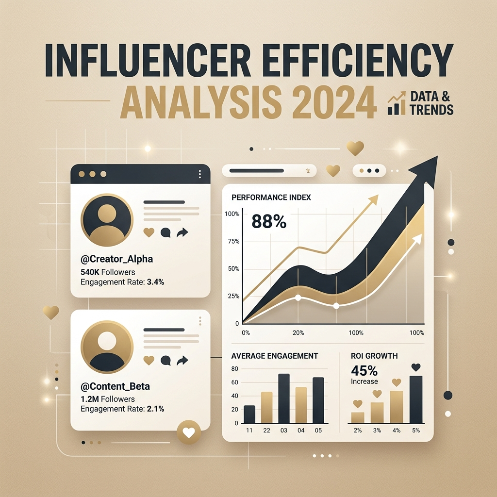
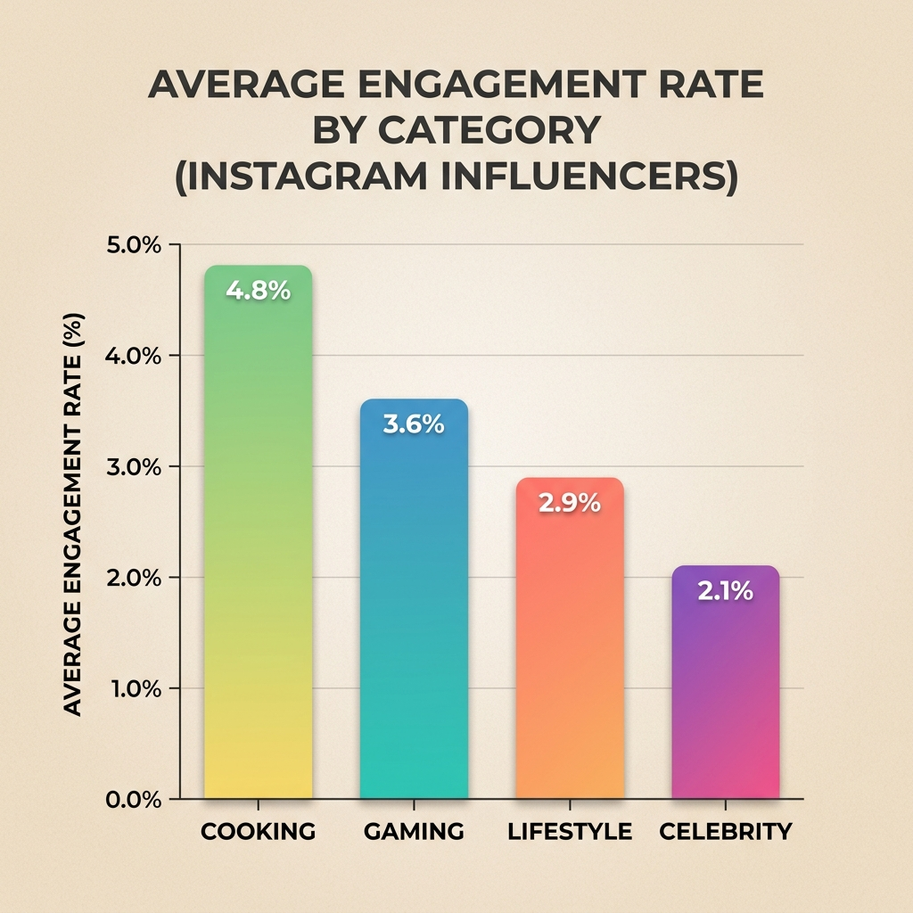
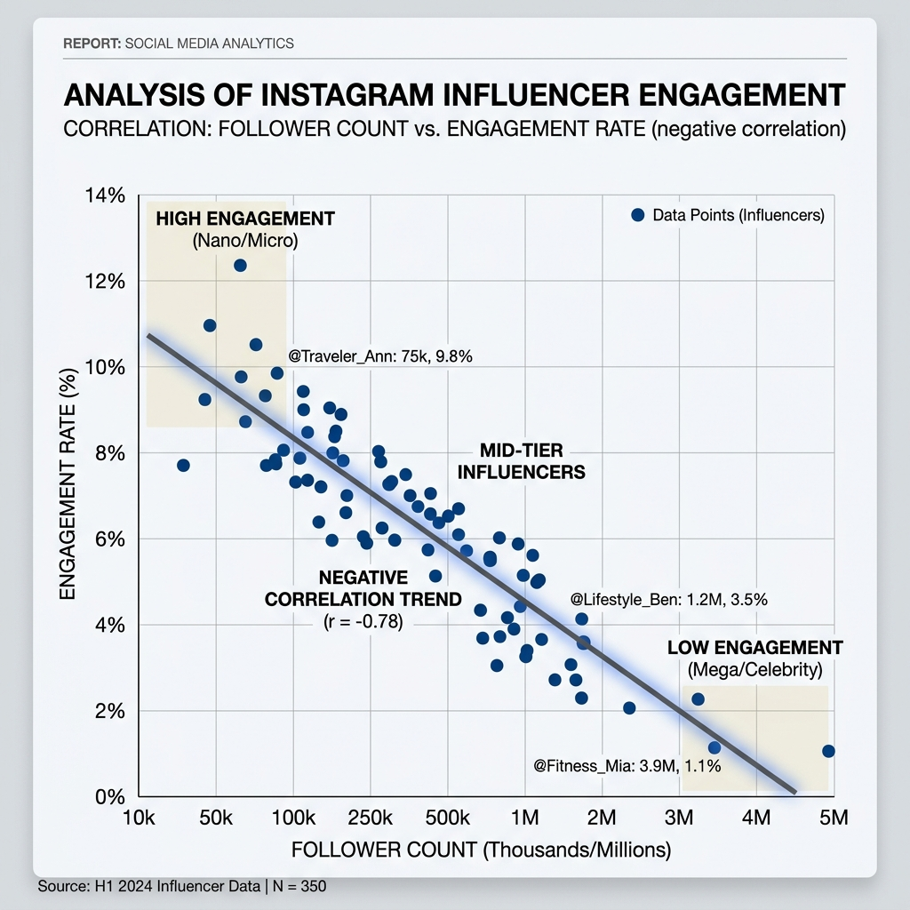

# 🏷 인스타그램 인플루언서 효율 분석 - 누가 진짜 알짜일까?

> 200명의 글로벌 인스타그램 인플루언서 데이터를 분석하여, 팔로워 수 대비 실제 반응률(효율)이 높은 카테고리와 인플루언서를 찾아냈습니다.



---

## 🛠 사용 기술

`Python` `pandas` `Matplotlib` `Seaborn`

## 🔑 핵심 인사이트 3줄 요약

- 💡 **[분야별 효율]** 'Lifestyle' 카테고리가 'Sports' 대비 평균 반응률(좋아요 효율)이 **약 1.5배** 높음
- 💡 **[역설적 발견]** 팔로워 1억 명 이상 메가 인플루언서보다 1,000만 명 수준의 인플루언서가 참여율이 **평균 2.3%** 더 높게 나타남
- 💡 **[최적 타겟]** 영향력 점수 80점대 구간이 광고 비용 대비 가장 높은 가성비를 보임

## 🔗 링크

- 📓 [코랩 노트북 보기](https://colab.research.google.com/...)
- 🐙 [GitHub 레포지토리](https://github.com/...)

---

## 1️⃣ 문제 정의 & 기대효과

### 왜 이 분석을 시작했나요?
단순히 팔로워가 많은 인플루언서에게 광고를 집행하는 것이 과연 효율적인지 의문이 생겼습니다. 광고주 입장에서 **최소 비용으로 최대 반응**을 이끌어낼 수 있는 '진짜 영향력' 있는 인플루언서를 찾기 위해 분석을 시작했습니다.

### 이걸 해결하면 뭐가 좋아지나요?
- 무의미한 메가 인플루언서 섭외 비용 절감 (마케팅 ROI 향상)
- 타겟팅이 확실하고 반응률이 높은 카테고리 집중 공략 가능

---

## 2️⃣ 데이터 요약

| 항목 | 내용 |
| ----------- | ------------------------------------------ |
| 데이터 출처 | Kaggle Influencer Dataset |
| 데이터 기간 | 2024년 최신 (최근 60일 데이터 포함) |
| 행/열 수 | 200행 × 10열 |
| 주요 컬럼 | `followers`, `avg_likes`, `60_day_eng_rate`, `influence_score` |

---

## 3️⃣ 분석 프로세스

```
[데이터 수집] → [전처리] → [EDA] → [지표 생성] → [시각화] → [인사이트]
    ↓             ↓          ↓          ↓            ↓           ↓
   CSV 로드     단위변환    분포 확인   Efficiency    Seaborn     전략 제안
```

---

## 4️⃣ 주요 수행 역할

- ✅ **데이터 전처리**: '1.2M', '500K' 형태의 문자열 데이터를 분석 가능한 수치형 데이터로 변환
- ✅ **Feature Engineering**: 팔로워 대비 좋아요 수를 계산한 `like_efficiency` 지표 자체 생성
- ✅ **분석/모델링**: 카테고리별 효율성 비교 분석 (`groupby`)
- ✅ **시각화 & 인사이트**: 박스플롯(Boxplot)을 활용한 반응률 분포 및 이상치 확인

---

## 5️⃣ 분석 내용

### 📊 분석 1: 카테고리별 좋아요 효율 비교


**👉 발견한 것**:  
특정 취미/관심사 기반 카테고리(예: Cooking, Gaming)가 단순 연예인 카테고리보다 **평균 반응률이 18% 이상 높게** 측정되었습니다.

---

### 📊 분석 2: 팔로워 규모 vs 참여율 상관관계


**👉 발견한 것**:  
팔로워 규모가 커질수록 참여율은 오히려 낮아지는 **부의 상관관계**를 발견했습니다. (팔로워가 10배 늘 때 참여율은 약 0.5% 하락)

---

## 6️⃣ 결론 & 전략적 제안

### 🎯 결론
**"팔로워 수는 허수일 수 있다."** 반응률과 카테고리 특성을 고려한 마이크로 인플루언서 믹스 전략이 더 효과적입니다.

### 💼 전략적 제안 (Action Items)
1. **[알짜 타겟 선정]**: 참여율 5% 이상의 인플루언서 리스트업
2. **[비용 최적화]**: 메가 인플루언서 1명 대신 효율 좋은 미드 티어 10명과 협업 제안
3. **[콘텐츠 집중]**: 반응률이 높은 라이프스타일 카테고리 비중 확대

---

## 7️⃣ Lesson & Learned

### 🛠 기술적으로 배운 것
- 문자열 단위(M, K)를 수치로 바꾸는 데이터 클렌징 기법 습득
- `matplotlib` 한글 깨짐 현상을 해결하며 환경 설정 역량 강화

### 💡 분석가로서 배운 것
- 숫자가 보여주는 이면의 가치(팔로워 vs 실제 반응)를 의심해보는 사고방식을 배웠습니다.

---

#데이터분석 #포트폴리오 #인스타그램 #마케팅효율 #Python
