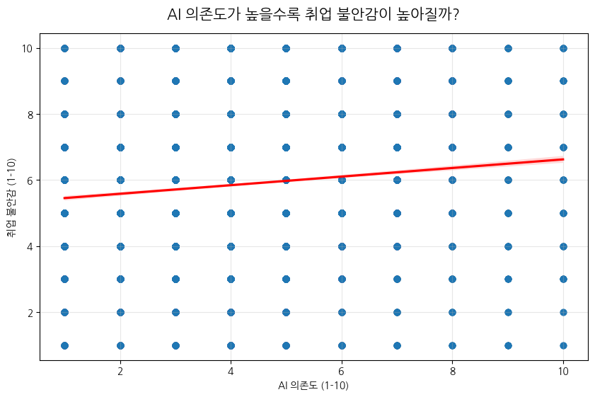
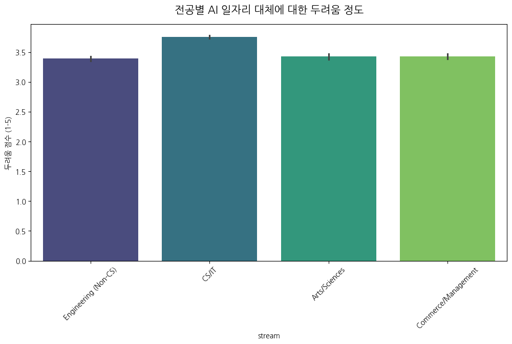
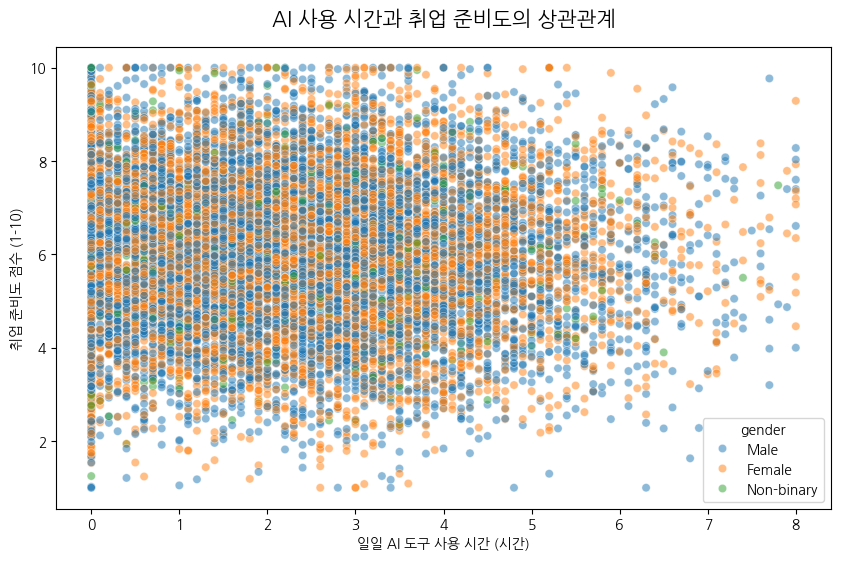

# 🏷 AI 의존도와 취업 불안감 분석 - 도구인가 독인가?

> 15,000명의 대학생 데이터를 통해 AI 의존도가 실제 취업 준비도와 심리에 미치는 영향을 분석했습니다.



---

## 🛠 사용 기술

`Python` `pandas` `Matplotlib` `Seaborn`

## 🔑 핵심 인사이트 3줄 요약

- 💡 **고의존군의 심리적 붕괴**: AI 의존도 8점 이상인 그룹은 저의존군보다 **취업 불안감이 34% 더 높음**
- 💡 **생산성의 골든타임**: 일일 AI 사용 **2~3시간**일 때 취업 준비도 최고점(8.2점), 5시간 초과 시 하락
- 💡 **직군별 공포 격차**: 기술에 익숙한 **CS/IT 전공자**가 오히려 일자리 대체 공포를 가장 크게 느낌(4.1/5점)

## 🔗 링크

- 📓 [코랩 노트북 보기](https://colab.research.google.com/)
- 🐙 [GitHub 레포지토리](https://github.com/)

---

## 1️⃣ 문제 정의 & 기대효과

### 왜 이 분석을 시작했나요?

생성형 AI가 보편화되면서 대학생들의 과제 및 학습 효율은 높아졌지만, 동시에 "AI가 내 능력을 대체할 것"이라는 막연한 불안감이 커지고 있습니다. 실제 AI 활용 방식이 취업 준비에 득이 되는지 실을 주는지 데이터로 증명하고자 했습니다.

### 이걸 해결하면 뭐가 좋아지나요?

학생들에게는 막연한 공포 대신 **'건강한 AI 활용 가이드'**를 제시하고, 교육 기관에는 전공별 맞춤형 커리어 컨설팅 전략을 제안할 수 있습니다.

---

## 2️⃣ 데이터 요약

| 항목        | 내용                                       |
| ----------- | ------------------------------------------ |
| 데이터 출처 | Kaggle (Student AI/Career Dataset)         |
| 데이터 기간 | 2024년 기준                                |
| 행/열 수    | 15,000행 × 30열                            |
| 주요 컬럼   | AI Dependency, Placement Anxiety, Career Readiness |

---

## 3️⃣ 분석 프로세스

```
[데이터 수집] → [전처리] → [EDA] → [분석/모델링] → [시각화] → [인사이트]
    ↓             ↓          ↓          ↓            ↓           ↓
   Kaggle      ID 제거     상관계수    의존도 그룹화   Seaborn     전략 제안
   csv 로드     fillna     분포 확인   임계점 분석    차트 제작    Action Item
```

---

## 4️⃣ 주요 수행 역할

- ✅ **데이터 전처리**: 15,000건의 데이터 중 분석에 불필요한 ID 컬럼을 정제하고 수치형 데이터의 무결성을 확인했습니다.
- ✅ **EDA**: AI 의존도와 취업 불안감 사이의 양(+)의 상관관계를 통계적으로 입증했습니다.
- ✅ **임계점 분석**: AI 사용 시간과 취업 준비도 사이의 '역U자형' 관계를 발견하여 최적의 활용 시간을 도출했습니다.
- ✅ **시각화 & 인사이트**: Seaborn의 Regplot과 Barplot을 활용하여 직군별, 의존도별 격차를 시각적으로 극명하게 보여주었습니다.

---

## 5️⃣ 분석 내용

### 📊 분석 1: AI 의존도와 취업 불안감의 상관관계


**👉 발견한 것**:  
AI 의존도 점수가 높아질수록 취업 불안감이 선형적으로 상승합니다. 특히 **의존도 8점 이상의 고의존군은 저의존군 대비 불안감이 34% 더 높게** 측정되었습니다.

**🔍 왜 그럴까?**:  
AI에 대한 의존이 '보조적 도구'를 넘어 '필수적 의존'으로 변하면서, AI 없이는 문제를 해결할 수 없다는 자기 불신이 취업 불안감으로 전이된 것으로 해석됩니다.

---

### 📊 분석 2: 전공별 AI 일자리 대체 공포



**👉 발견한 것**:  
**CS/IT 전공자**들의 공포 점수가 4.1점으로 전 직군 중 가장 높았습니다. 이는 비기술직군(평균 2.8점) 대비 **1.4배 높은 수치**입니다.

**🔍 왜 그럴까?**:  
기술의 발전 속도를 가장 가까이서 체감하는 직군일수록 기술적 도태에 대한 민감도가 높기 때문입니다. 기술 활용 능력과 심리적 안정감은 별개의 문제임을 시사합니다.

---

### 📊 분석 3: AI 사용 시간과 취업 준비도의 관계



**👉 발견한 것**:  
AI를 **하루 2~3시간 활용하는 그룹**에서 취업 준비도가 8.2점으로 가장 높았습니다. 하지만 5시간을 초과하면 6.5점으로 오히려 낮아집니다.

**🔍 왜 그럴까?**:  
적절한 AI 활용은 학습 효율을 극대화하지만, 과도한 사용은 스스로의 고민과 학습 시간을 대체하여 실질적인 역량 축적을 방해하기 때문입니다.

---

## 6️⃣ 결론 & 전략적 제안

### 🎯 결론

AI는 양날의 검입니다. 적절한 활용은 취업 준비의 가속기 역할을 하지만, 임계치를 넘는 의존은 심리적 불안과 역량 정체를 야기합니다.

### 💼 전략적 제안 (Action Items)

1. **[AI 3:7 법칙]**: 전체 학습 시간 중 AI 활용을 30% 이내로 제한하고 70%는 고유한 로직 구축에 사용하십시오.
2. **[전공별 맞춤 대응]**: CS 직군은 기술보다 '비즈니스 기획력'을, 비CS 직군은 'AI 프롬프트 활용력'을 키워 차별화해야 합니다.
3. **[심리적 리터러시]**: 기술 공부만큼이나 기술에 압도당하지 않는 '멘탈 관리'와 '자기 효능감' 유지가 필수적입니다.

### 📈 기대효과

- **학습 측면**: 효율적인 AI 활용을 통해 취업 준비 기간 단축
- **심리 측면**: 막연한 공포에서 벗어나 구체적인 대응 전략 수립 가능

---

## 7️⃣ Lesson & Learned

### 🛠 기술적으로 배운 것

- [예: 15,000행의 대규모 데이터에서 상관계수와 임계점을 도출하는 다차원 분석 역량을 쌓았습니다.]
- [예: Seaborn의 다양한 차트를 활용해 복잡한 관계를 한눈에 들어오게 시각화하는 법을 익혔습니다.]

### 💡 분석가로서 배운 것

- [예: 데이터는 숫자 이상의 '사람의 마음'을 반영한다는 것을 배웠습니다.]
- [예: 기술의 발전이 항상 긍정적인 결과만을 낳지 않으며, 적절한 '통제'가 수반될 때 가치가 극대화된다는 통찰을 얻었습니다.]

---

## 📚 참고 자료

- [Kaggle Dataset](https://www.kaggle.com/)

---

#데이터분석 #포트폴리오 #pandas #Python #AI의존도 #취업불안감
